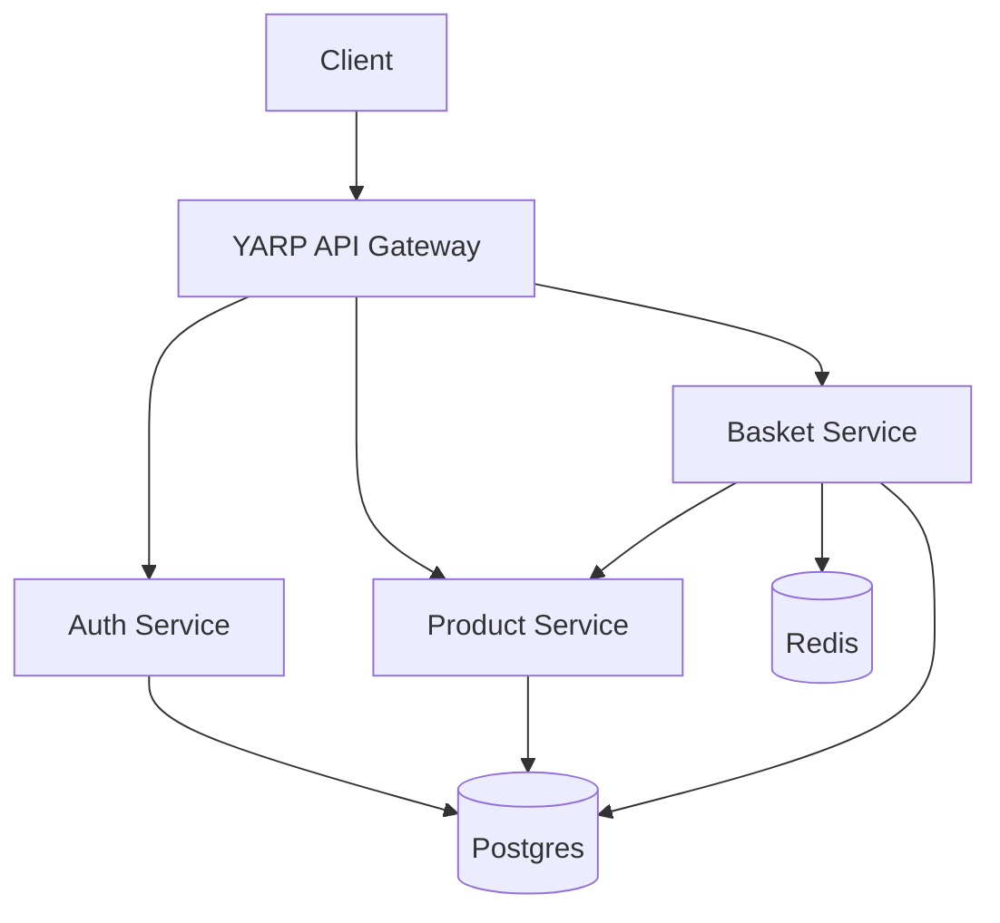
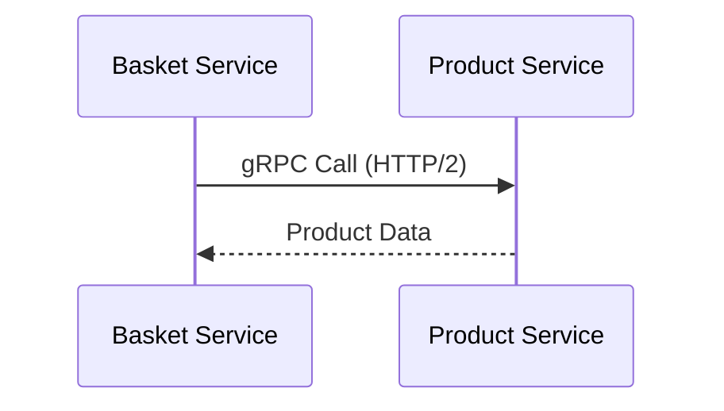
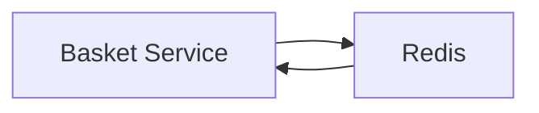
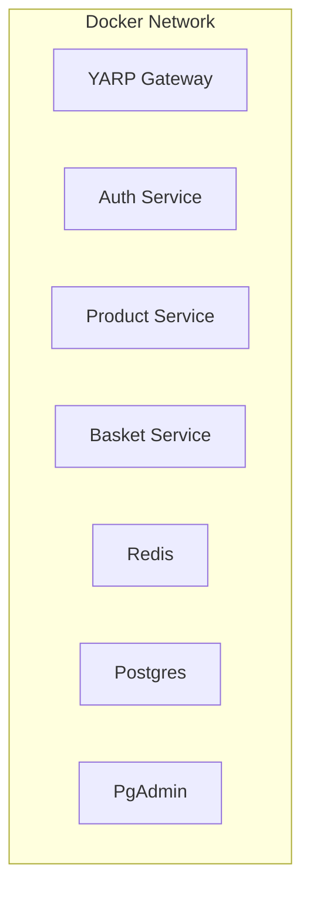
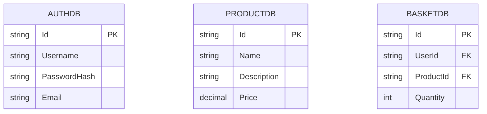

# Microservices Architecture with Docker

This project demonstrates a microservices architecture using .NET 8, Docker, Yarp. It consists of multiple services communicating through HTTP/2, gRPC, and Redis.

## Architecture Overview



## Services

### 1. YARP API Gateway
- Port: 5261 (HTTPS)
- Routes:
  - `/auth/*` → Auth Service
  - `/product/*` → Product Service
  - `/basket/*` → Basket Service
- Features:
  - Reverse Proxy
  - Load Balancing
  - Path Rewriting
  - HTTPS Termination

### 2. Auth Service
- Port: 5025 (HTTP)
- Database: Postgres (AuthDb)
- Features:
  - JWT Authentication
  - User Management
  - Data Protection

### 3. Product Service
- Ports:
  - 5020: HTTP/1.1 (Swagger)
  - 5021: HTTP/2 (gRPC)
- Database: Postgres (ProductDb)
- Features:
  - Product Management
  - gRPC Server
  - Swagger Documentation

### 4. Basket Service
- Ports:
  - 5113: HTTP/1.1 (Swagger)
  - 5114: HTTP/2 (gRPC)
- Database: Postgres (BasketDb)
- Cache: Redis
- Features:
  - Shopping Cart Management
  - gRPC Client (Product Service)
  - Redis Caching
  - Swagger Documentation

## Communication Patterns

### HTTP/2 and gRPC


- Product Service exposes gRPC endpoints on port 5021
- Basket Service consumes these endpoints using gRPC client
- HTTP/2 is used for better performance and bidirectional streaming

### Redis Caching


- Basket Service uses Redis for cart caching
- Improves performance for cart operations
- Provides distributed caching across multiple instances

## Docker Architecture



### Container Configuration
- All services run in isolated containers
- Network communication through Docker bridge network
- Volume mounts for:
  - Postgres data persistence
  - Redis data persistence
  - Certificate sharing
  - Data protection keys

## Development Setup

1. Clone the repository
2. Generate SSL certificate:
   ```bash
   dotnet dev-certs https -ep cert.pfx -p password
   ```
3. Start services:
   ```bash
   docker-compose up --build
   ```

## Service URLs

- YARP API Gateway: https://localhost:5261
- Auth Service: http://localhost:5025
- Product Service:
  - Swagger: https://localhost:5020
  - gRPC: https://localhost:5021
- Basket Service:
  - Swagger: https://localhost:5113
  - gRPC: https://localhost:5114
- PgAdmin: http://localhost:5050

## Technical Details

### Why Two Ports for Product and Basket Services?
- Port 5020/5113: HTTP/1.1 for Swagger UI and regular HTTP requests
- Port 5021/5114: HTTP/2 for gRPC communication
- Swagger doesn't support HTTP/2, hence the separate ports

### Redis Implementation in Basket Service
- Used for cart caching
- Improves performance for cart operations
- Provides distributed caching
- Handles concurrent cart updates

### gRPC Communication
- Product Service acts as gRPC server
- Basket Service acts as gRPC client
- Protocol Buffers for efficient serialization
- HTTP/2 for better performance

### Database Schema


## Security

- HTTPS with custom certificates
- JWT authentication
- Data protection for sensitive information
- Secure communication between services
- Environment variable management 
